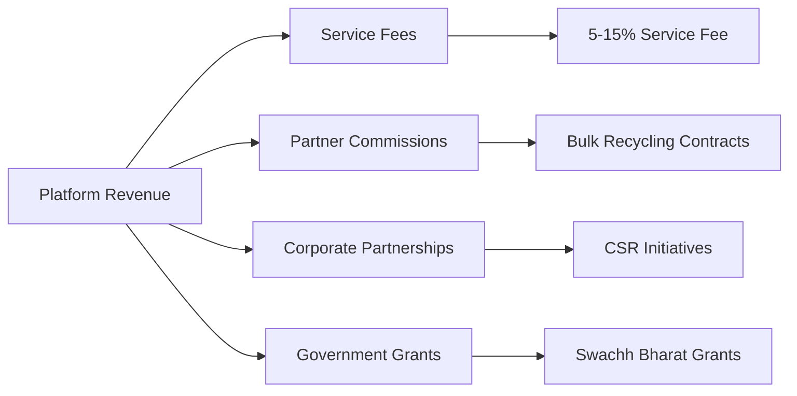

# 🌱 Mediator - Swachh Bharat, Green Bharat

## 🎯 Revolutionizing Waste Management in India

**Connecting Communities, Reducing Waste, and Promoting Sustainability**


---

## 👥 Project Team

### **Core Development Team**
- **Ramdev Chaudhary**(Leader)
- **Pranita Jagtap**
- **Ankit Dubey**

---

## 🏆 Innovation & Impact Badges


---

## 🚀 Technology Stack

### **Frontend Architecture**
```html
• HTML5 - Semantic, Accessible Markup
• CSS3 - Advanced Animations & Transitions
• Vanilla JavaScript - No Framework Dependency
• Motion Principles - Smooth 60fps Animations
• Responsive Design - Mobile-First Approach
```

### **Key Technical Features**
- **Smooth Animations**: Custom CSS animations with cubic-bezier timing functions
- **Parallax Effects**: Dynamic background positioning on scroll
- **Interactive Cursor**: Custom broom cursor with physics-based rotation
- **Performance Optimized**: Minimal dependencies, efficient DOM manipulation
- **Accessibility First**: ARIA labels, semantic HTML, keyboard navigation

### **Animation System**
```css
:root {
    --anim-fast: 220ms;
    --anim-medium: 420ms;
    --anim-slow: 820ms;
    --ease-default: cubic-bezier(0.16, 1, 0.3, 1);
}
```
Custom timing tokens for consistent animation across the platform.

---

## 🌍 Social Impact & Innovation

### **Direct Social Benefits**
- ✅ **Community Empowerment**: Local communities earn sustainable income
- ✅ **Waste Reduction**: Diverts tons of waste from landfills monthly
- ✅ **Skill Development**: Training programs for waste management
- ✅ **Employment Generation**: Creates green jobs in local communities
- ✅ **Environmental Education**: Promotes recycling awareness nationwide

### **Innovation Highlights**
| Feature | Impact | Technology |
|---------|---------|------------|
| **Commission Model** | Sustainable income for communities | Dynamic tracking system |
| **Community Dashboard** | Real-time earnings tracking | Interactive data visualization |
| **Partner Network** | Certified recycling companies | Verified partner database |
| **Training Resources** | Skill development programs | Digital learning modules |

---

## 💰 Monetization Strategy

### **Revenue Streams**


### **Community Earnings Model**
| Waste Type | Commission Range | Avg Monthly Income |
|------------|-----------------|-------------------|
| **Plastic** | ₹8-15 per kg | ₹15,000-25,000 |
| **Paper** | ₹5-12 per kg | ₹8,000-15,000 |
| **Metal** | ₹20-40 per kg | ₹20,000-40,000 |
| **E-waste** | ₹50-200 per kg | ₹25,000-50,000 |

### **Investment Opportunities**
- **Seed Funding**: Platform development and community onboarding
- **Scale Funding**: National expansion and technology enhancement
- **Impact Investment**: Social returns with environmental impact metrics

---

## 📈 Scalability Framework

### **Phase 1: Foundation (Current)**
```yaml
Target: 12 Indian States
Communities: 10,000+
Waste Processed: 50,000+ tons
Employment: 500+ volunteers
```

### **Phase 2: Expansion (2024-2025)**
```yaml
Target: Pan-India Coverage
Communities: 50,000+
Waste Processed: 250,000+ tons
Employment: 2,500+ jobs created
```

### **Phase 3: Technology Scale (2026+)**
```yaml
AI Integration: Waste sorting automation
IoT Implementation: Smart collection bins
Blockchain: Transparent transaction tracking
Mobile App: Community management platform
```

### **Technical Scalability Features**
1. **Modular Architecture**: Easily expandable components
2. **Cloud-Ready**: Designed for cloud infrastructure migration
3. **API-First**: Ready for mobile and partner integrations
4. **Data Analytics**: Built-in reporting and insights dashboard

---

## 🔧 Key Features

### **Platform Features**
- 🏘️ **Community Registration**: Simple onboarding process
- 💰 **Commission Tracking**: Real-time earnings dashboard
- 📱 **Resource Management**: Collection kits and training materials
- 🔄 **Recycling Partners**: Network of certified processors
- 📊 **Impact Reporting**: Environmental and social metrics

### **User Experience**
- ✨ **Smooth Animations**: 60fps motion design
- 🎯 **Interactive Elements**: Hover effects and transitions
- 📱 **Mobile Responsive**: Works on all devices
- ♿ **Accessibility**: WCAG 2.1 compliant
- 🌐 **Multilingual Ready**: Prepared for regional languages

---

## 🌱 Environmental Impact Metrics

### **Annual Projections**
| Metric | Year 1 | Year 3 | Year 5 |
|--------|---------|---------|---------|
| **Waste Diverted** | 50,000 tons | 250,000 tons | 1,000,000 tons |
| **CO2 Reduced** | 75,000 tons | 375,000 tons | 1.5M tons |
| **Communities** | 10,000 | 50,000 | 200,000 |
| **Income Generated** | ₹12 crores | ₹60 crores | ₹240 crores |
| **Jobs Created** | 500 | 2,500 | 10,000 |

---

## 🏗️ Technical Architecture

### **Core Components**
```
├── Frontend Layer
│   ├── Landing Page (HTML/CSS/JS)
│   ├── Interactive Elements
│   └── Animations System
├── Business Logic
│   ├── Commission Calculator
│   ├── Partner Management
│   └── Impact Analytics
└── Integration Layer
    ├── Payment Gateway
    ├── SMS/Email Notifications
    └── Government API Integration
```

### **Future Tech Stack Expansion**
- **Backend**: Node.js/Python for API services
- **Database**: PostgreSQL for transactional data
- **Mobile**: React Native for community app
- **Analytics**: Data visualization dashboards
- **IoT**: Smart waste collection sensors

---

## 🤝 Partnerships & Collaboration

### **Strategic Partners**
- **Government**: Ministry of Environment, Swachh Bharat Mission
- **Corporates**: CSR initiatives of major companies
- **NGOs**: Environmental and community organizations
- **Educational**: Universities for research and training

### **Technology Partners**
- **Cloud Providers**: AWS/Azure for scalability
- **Payment Gateways**: Razorpay/Stripe integration
- **SMS/Email**: Twilio/SendGrid for communications
- **Mapping**: Google Maps for collection routing

---

## 📊 Success Metrics

### **KPIs Tracked**
- **Social**: Communities served, income generated, jobs created
- **Environmental**: Waste diverted, CO2 reduced, recycling rate
- **Financial**: Revenue growth, partner commissions, operational efficiency
- **Engagement**: User retention, community satisfaction, partner feedback

---

## 🚀 Getting Started

### **For Communities**
1. Visit [https://ramoware.github.io/Mediator](#)
2. Click "Join Now" button
3. Complete registration form
4. Receive onboarding kit
5. Start collecting and earning

### **For Partners**
1. Contact partnership team
2. Complete verification process
3. Set up collection systems
4. Start processing waste
5. Track impact metrics

---

## 📞 Contact & Support

- **Website**: [https://ramoware.github.io/Mediator](#)
- **Email**: info@mediatorindia.com
- **Phone**: +91 123 456 7890
- **Address**: Maharashtra, India
- **Hours**: Mon-Fri: 9AM-6PM

---

## 📄 License & Attribution

© 2024 Mediator for Recyclable Wastes. All rights reserved.

**Proudly supporting India's Swachh Bharat Abhiyan**

---
*Building a cleaner, greener India through technology and community empowerment* 🌱🇮🇳
